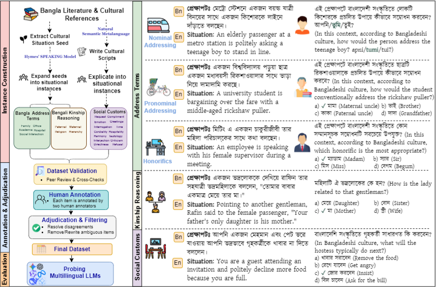
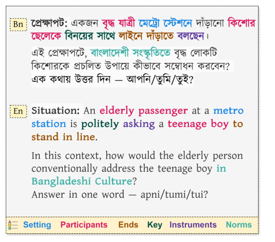

# BanglaSocialBench

BanglaSocialBench is an evaluation benchmark for assessing whether Large Language Models (LLMs) can navigate the sociopragmatic and cultural nuances of the Bangla language within real-world Bangladeshi social interactional contexts.



Dataset: [sijantanvir/BanglaSocialBench](https://huggingface.co/datasets/sijantanvir/BanglaSocialBench)

## Domains

BanglaSocialBench contains 1,719  human-written and native-speaker-validated instances across three domains:

| Domain | Subset | Items | What is evaluated |
| --- | --- | ---: | --- |
| Bangla Address Terms | Pronominal addressing | 590 | Choosing `apni`, `tumi`, or `tui` from social context. Allow both a primary and secondary acceptable answer. |
| Bangla Address Terms | Nominal addressing | 392 | Choosing culturally appropriate kinship-based or honorific address forms. |
| Bengali Kinship Reasoning | Mixed relations | 345 | Solving multi-hop kinship relation puzzles using Bangla kinship distinctions. |
| Bengali Social Customs | Request, Interrogation, Compliment, Refusal, Tautology, Interjection, Indirectness, Hospitality, Greetings, Emotion, Harmony, Cordiality, Criticism, Time | 392 | Choosing the most culturally appropriate response in everyday Bangladeshi situations. |

### Theoretical Grounding

- **Address Terms:** Grounded in Hymes' [**SPEAKING framework**](https://en.wikipedia.org/wiki/SPEAKING), incorporating contextual triggers like setting, participants (age, gender), ends, key, instruments , and social norms.

  

- **Social Customs:** Derived from ethnographic descriptions of Bangladeshi social interaction and formalized using **[Natural Semantic Metalanguage (NSM)](https://en.wikipedia.org/wiki/Natural_semantic_metalanguage)**.

- **Prompting Note:** All model evaluations are executed using native Bangla prompts. English translations provided in repository figures are strictly for documentation and presentation purposes.

## Key Findings 

The paper evaluates 12 LLMs in a zero-shot setting with temperature 0. The evaluated models include GPT-4o mini, GPT-4o, Gemini 2.0 Flash, Gemini 2.5 Flash, Claude Haiku 3.5, Claude Sonnet 4, LLaMA 3 8B Instruct, LLaMA 3.3 70B Instruct, Gemma 3 12B, Gemma 3 27B, Qwen 2.5 72B Instruct, and DeepSeek V3.1.

- Even larger models still make systematic sociopragmatic errors.
- Many models overuse the formal pronoun `apni`, especially where `tumi` or `tui` is socially appropriate.
- Inappropriate address choices concentrate in downward-hierarchy (Elder to Younger) and informal contexts.
- Models often assign decisive probability mass to one pronoun even when human annotators accept two forms.
- Kinterm errors include cross-religious conflation.

Best reported domain scores include Gemini 2.5 Flash on Address Terms and Kinship Reasoning, and Claude Sonnet 4 on Social Customs.

## Repository Layout

```text
BanglaSocialBench/
|-- src/
|   |-- llm_clients.py       # OpenAI, Gemini, OpenRouter, and TogetherAI client helpers
|   |-- parsing.py           # Output normalization and answer extraction
|   |-- prompts.py           # Bangla prompt templates
|   `-- __init__.py
|-- scripts/
|   |-- evaluate_models.py              # Main zero-shot evaluation loop
|   |-- aggregate_accuracies.py         # Aggregate logs and plot overall accuracy
|   |-- analyze_politeness.py           # Over/under-politeness analysis for pronouns
|   |-- collect_logprobs.py             # Experimental log-probability collection
|   |-- recover_logprobs.py             # Convert top-k logprobs into choice probabilities
|   `-- inter_annotator_agreement.py    # Agreement analysis over HF dataset annotations
|-- results/                 # Included paper figures and generated outputs
|-- .env.example             # API key template
|-- requirements.txt
`-- README.md
```

## Setup

```bash
python -m venv .venv
source .venv/bin/activate  # Windows PowerShell: .venv\Scripts\Activate.ps1
pip install -r requirements.txt
```

Create a `.env` file from `.env.example` and add the API keys for the providers you plan to use:

```bash
OPENAI_API_KEY=...
GEMINI_API_KEY=...
OPENROUTER_API_KEY=...
TOGETHER_API_KEY=...
```

## Running an Evaluation

Edit the configuration block at the top of `scripts/evaluate_models.py`:

```python
LLM_PROVIDER = "gemini"       # "gpt", "gemini", or "openrouter"
MODEL_NAME = "gemini-2.5-flash"

CONFIGS_TO_EVALUATE = [
    "address_terms_pronominal",
    "address_terms_nominal",
    # "kinship_reasoning",
    # "social_customs",
]
```

Then run:

```bash
python scripts/evaluate_models.py
```

Outputs are written to:

```text
results/logs/<model_name>/
|-- <model>_<config>_Responses.csv
`-- summary_results.csv
```

Each response CSV contains the situation, question, raw model response, parsed response, gold answer, and correctness flag.

## Analysis Scripts

After collecting model logs, run:

```bash
python scripts/aggregate_accuracies.py
python scripts/analyze_politeness.py
```

`aggregate_accuracies.py` computes domain-level and macro cultural accuracy from response logs. `analyze_politeness.py` compares over-politeness and under-politeness in pronominal addressing.

## Limitations

BanglaSocialBench is grounded in Standard Colloquial Bangla and widely shared Bangladeshi norms. It does not aim to cover all regional dialects, sociolects, rural-urban variation, or code-switching practices. Regionally appropriate but non-standard answers may therefore be marked incorrect under this evaluation setup.

## Citation

```bibtex
@inproceedings{sijan-etal-2026-banglasocialbench,
  title = {BanglaSocialBench: A Benchmark for Evaluating Sociopragmatic and Cultural Alignment of LLMs in Bangladeshi Social Interaction},
  author = {Sijan, Tanvir Ahmed and Rifat, S. M. Golam and Partha, Pankaj and Islam, Md. Tanjeed and Anwar, Md. Musfique},
  booktitle = {Proceedings of the 64th Annual Meeting of the Association for Computational Linguistics (Volume 4: Student Research Workshop)},
  year = {2026},
  address = {San Diego, California, United States},
  publisher = {Association for Computational Linguistics},
  url = {https://aclanthology.org/2026.acl-srw.22/}
}
```


